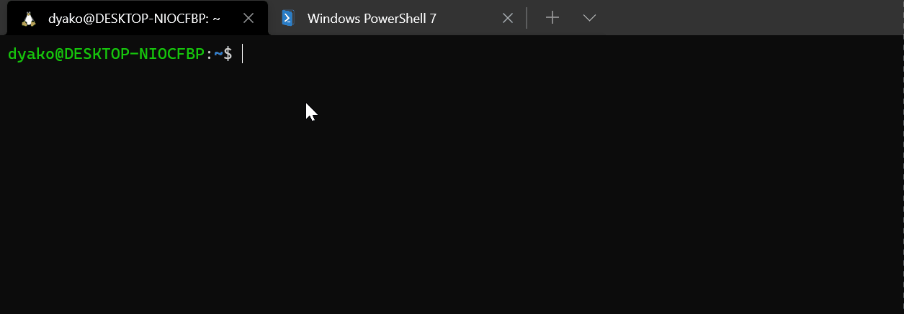

# Simple Global Weather CLI tool

A simple tool to get current weather data

## Requirement
[dotnet 6](https://dotnet.microsoft.com/en-us/) 

## Download
Download nupkg package [here](https://github.com/dyako-baram/WeatherCLI/releases/download/v1/Weather.1.0.0.nupkg) 

go to the same directory as the `Weather.1.0.0.nupkg` file and run this command to install it globally

    dotnet tool install weather --global --add-source .
to uninstall it run this command

    dotnet tool uninstall weather -g

## Usage

in the terminal run `weather`

or you can pass one argument for the location, default is `sulaymaniyah`

runing with argument: `weather london`

## building your own
download the project

change the `apikey` and  `location` variable as needed
and run this command  `dotnet pack` 
